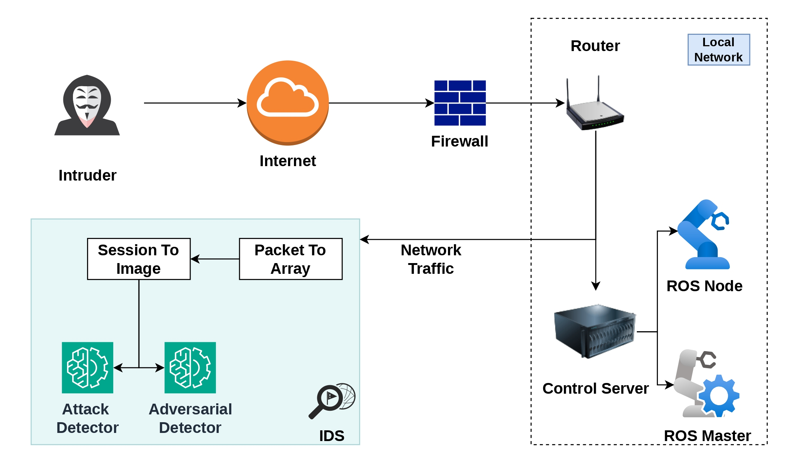
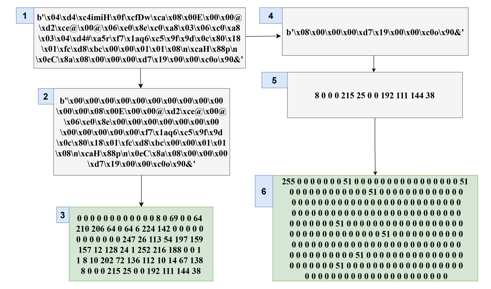
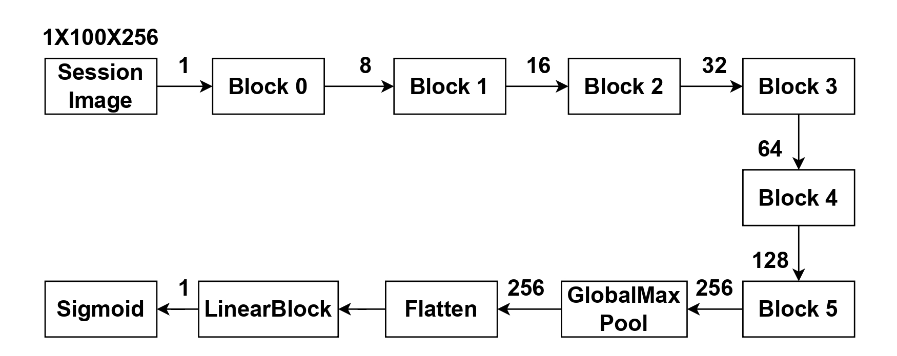
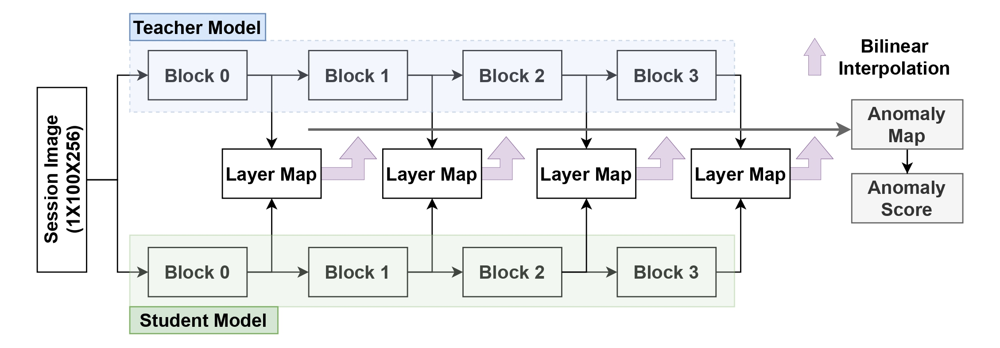

# ROSAID-ST: Adversarially Robust Intrusion and Anomaly Detection in ROS Networks via Student-Teacher Deep Learning



A proposed flow of an IDS.

## Setting Up
1. Download the dataset:
    - DNP3 Intrusion Detection Dataset from [Zenodo](https://zenodo.org/records/7348493).
    - IEC Dataset from [Zenodo](https://zenodo.org/records/14096593). After unzipping IEC104~340MB and IEC61850~40GB.
    - ROSIDS23 Dataset from [Zenodo](https://zenodo.org/records/10014434).
2. Unzip and copy all the CSV files related to CICFlowmeter and paste in a single folder.
3. These files will be the main data files.
4. Read all files and combine them into a single CSV file. This file will be used to train models.
5. Install this project as `pip install -e .` and all its requirements too.
6. Install PyTorch with CUDA support: `pip install torch==2.5.0 torchvision==0.20.0 torchaudio==2.5.0 --index-url https://download.pytorch.org/whl/cu124`.


## PCAP to Image



A PCAP to Image process with intermediate steps.

### Issues with PCAP to Image
CICFlowmeter extracts the timestamp with only support for seconds, and hence, finding the correct start frame would not be possible. As a result, 100% match rate will not be possible.

Extracting images from large PCAP takes huge amount of time. Hence multiprocessing has been implemented to run one process in each of suggested cores. First the PCAP is truncated with timestamp using `editcap` then filtered with IP addressess using `tshark`. This final filtered PCAP is read and filtered again before converting to image. However these tools are not available in HPC and has to be installed with [`spack`](https://doc.nhr.fau.de/apps/spack/) or Apptainer. 

### Using Spack
- Load spack: `module load user-spack`
- Check if the wireshark is already available: `spack info wireshark `
- Install: `spack install wireshark` **Takes some time.**
- Verify: `spack spec wireshark`
- Verify: `module avail wireshark`
- Load: `module load wireshark/....`

### Using Apptainer 
We use Apptainer here.

```bash
apptainer pull cincan_tshark.sif docker://cincan/tshark
apptainer exec docker://cincan/tshark tshark -v
apptainer exec docker://cincan/tshark editcap -V
```

### For DNP3
* Read the CSV file for 120s Timeout and the corresponding PCAP files. Combine it using: [data_preparation/combine_csv.py](data_preparation/combine_csv.py)
* Main script is: [data_preparation/dnp3_pcap_to_img.py](data_preparation/dnp3_pcap_to_img.py). It needs a mapping file between CSV and PCAP file, and is inside [assets](assets/).

### For IEC104
Main script is [data_preparation/iec104_pcap_to_img.py](data_preparation/iec104_pcap_to_img.py).

### For ROSIDS23
Main script is [data_preparation/rosids23_pcap_to_img_mp.py](data_preparation/rosids23_pcap_to_img_mp.py). It uses multi processing and only 80% of the data is used. It is filtered by taking only those sessions which have total number of packets below or equal to 80 percentile. Slurm file for this task is: [jobs/rosids23_pcap_to_image.slurm](jobs/rosids23_pcap_to_image.slurm)

## Model Training
* As MLFlow is being used for logging the parameters, the command `mlflow server` should be run before training a model. But for the HPC, it is disabled.
* Dataset: [rosaid/data/dataset.py](rosaid/data/dataset.py).
* Trainer: [rosaid/trainers/trainer.py](rosaid/trainers/trainer.py). A single trainer to train all models, but this is used by other modules in [/trainers/](/trainers/).

### Training Attack Detection Model



* This is a binary classifier. Trained using: [trainers/session_image_clf_trainer.py](trainers/session_image_clf_trainer.py)
* Slurm File: [jobs/image_trainer_binary.slurm](jobs/image_trainer_binary.slurm)
* Single slurm file can handle the attack detection training for both ROSIDS23 and DNP3 dataset.

### STFPM Model



* It needs attack detection model from previous step. Trained using: [trainers/session_image_stfpm_trainer.py](trainers/session_image_stfpm_trainer.py)
* To train, DNP3 based teacher, an attack detection model has to be trained too.

## Adversarial Generation
* Only MIM and PGD are implemented. Using: [data_preparation/generate_adversarial_image.py](data_preparation/generate_adversarial_image.py)
* Slurm file: [jobs/adversarial_generator.slurm](jobs/adversarial_generator.slurm)

## Evaluation
* Baseline evaluation: Python: [evaluation/image_model_evaluation.py](evaluation/image_model_evaluation.py) Slurm:  [jobs/image_evaluation.slurm](jobs/image_evaluation.slurm)
* Adversarial evaluation: Python: [evaluation/adversarial_evaluation.py](evaluation/adversarial_evaluation.py) Slurm: [jobs/adversarial_evaluation.slurm](jobs/adversarial_evaluation.slurm)
* OOD evaluation: Python: [evaluation/ood_evaluation.py](evaluation/ood_evaluation.py) Slurm: [jobs/ood_evaluation.slurm](jobs/ood_evaluation.slurm)

## Generating Plots
* EDA Plots: [notebooks/data_eda.ipynb](notebooks/data_eda.ipynb) 
* Evaluation Plots: [notebooks/evaluation_plots.ipynb](notebooks/evaluation_plots.ipynb)  
* Adversarial Plots" [notebooks/adversarial.ipynb](notebooks/adversarial.ipynb)

## Acknowledgement
The authors gratefully acknowledge the scientific support and HPC resources provided by the Erlangen National High Performance Computing Center (NHR@FAU) of the Friedrich-Alexander-Universität Erlangen-Nürnberg (FAU). The hardware is funded by the German Research Foundation (DFG).

## Citation
Coming soon.